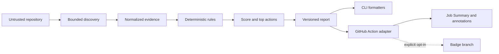

# AgentReady v0.1 architecture

Status: **planned; implementation scaffold only**

Last updated: 2026-08-29

## Architectural goal

AgentReady must produce the same explainable readiness result from a local CLI
and a GitHub Action without executing or uploading target repository code. The
architecture favors a small deterministic core, bounded input, explicit data
contracts, and thin delivery adapters.

## System context

The repository is outside the trust boundary. Its filenames, file contents,
configuration, symlinks, and instructions are input data only.

## Component boundaries

| Component | Owns | Must not own |
|---|---|---|
| `packages/core` | root validation, bounded discovery, evidence normalization, rules, scoring, recommendation ranking, report model | UI formatting, GitHub APIs, network, subprocesses, telemetry |
| `packages/cli` | argument parsing, exit codes, terminal/JSON/Markdown output, explicit `init` writes | duplicate rule or scoring logic, implicit target commands |
| `packages/action` | Action inputs, Job Summary, annotations, outputs, threshold result, optional badge orchestration | duplicate rule logic, broad permissions, secrets on fork PRs |
| `schemas` | versioned config, report, and rubric JSON Schemas | runtime-specific implementation details |
| `fixtures` | synthetic test repositories, malformed inputs, adversarial path/content cases | real credentials or copied private repositories |

Dependencies point inward. Adapters may depend on core, while core cannot depend
on an adapter or `@actions/*` package.

## Core pipeline

### 1. Root establishment

The caller supplies a candidate path. Core resolves one canonical repository
root, verifies that it is a directory, and carries that root through the scan.
Every later filesystem operation validates its resolved path against that root.

### 2. Bounded discovery

Discovery walks allowed directories without following symlinks. Before reading
content, it applies:

- `.gitignore` plus a security denylist;
- file-count, per-file-size, total-byte, and time limits;
- exclusions for `.git`, secret-like names, dependency vendors, build output,
  generated files, and caches;
- stable cross-platform path normalization and ordering.

Exact defaults and hard ceilings require an ADR before the discovery milestone.
Reaching a limit produces a diagnostic; it never silently invents evidence.

### 3. Evidence normalization

Parsers turn allowed content and metadata into typed evidence. Structured parsing
is preferred when it can be bounded and does not evaluate code. Text matching
must cap bytes and excerpt length. Evidence exposed in a report contains only a
normalized repository-relative path, evidence kind, short redacted summary, and
optional bounded location—not raw files.

### 4. Rule evaluation

Each rule is a pure deterministic function over normalized evidence and scan
context. A finding contains:

- stable namespaced `ruleId`;
- `pass`, `partial`, or `fail`;
- earned and maximum points;
- evidence references;
- human explanation;
- one concrete recommendation;
- rubric/report schema versions.

A parser or rule exception becomes a typed diagnostic when continuing is safe.
Security-boundary violations stop the affected read and are always visible.

### 5. Scoring and recommendations

Rubric v1 has fixed weights totaling 100. Configuration may change path scope,
preset, and `fail-under`, but cannot reweight rules or hide weak categories.
Recommendation ranking is deterministic: criticality, recoverable points,
estimated effort, and effect on real verifiability. The public report contains
at most the three highest-priority actions by default.

### 6. Rendering and delivery

The core returns one versioned report object. CLI formatters and the Action map
that object to their channels; they never recalculate findings or score. Output
must make incomplete scans and diagnostics visible.

## Determinism contract

Given the same AgentReady version, rubric version, configuration, repository
tree, and available local commit metadata, a scan must produce the same semantic
report. To preserve this:

- sort discovered paths and findings explicitly;
- do not use wall-clock time in scoring;
- isolate display timestamps from semantic equality;
- avoid locale-dependent comparison and formatting;
- never fetch remote state;
- record tool and schema versions in every report.

## GitHub Action boundary

The default Action job requires only `contents: read`. Pull requests from forks
must work without secrets or writes. The Action must not use
`pull_request_target` to execute against an untrusted checkout. Job Summary,
annotations, report artifacts, and outputs are read-only delivery modes.

Dynamic badge publication is a separate explicit mode. It may request only the
minimum `contents: write` permission and writes only documented generated files
to a dedicated branch. The static badge remains the safe fallback.

## Failure model

| Failure | Required behavior |
|---|---|
| missing/unreadable root | tool error; no score presented as complete |
| escaping path or symlink | skip read, emit security diagnostic |
| oversized/malformed file | skip or partially inspect, emit diagnostic |
| unsupported ecosystem | run generic checks, state reduced evidence coverage |
| parser or rule exception | isolate failure when safe, continue other rules |
| `fail-under` not met | valid report plus distinct threshold exit status |
| output write failure | preserve scan result in available channels; return tool error where required |

## Public contracts and versioning

Configuration, report, and rubric contracts use independent explicit versions.
Additive report fields may be backwards compatible; removal, renaming, meaning
changes, or scoring changes require a version decision and migration note. JSON
Schemas live in `schemas/` and are tested against fixtures.

## Open decisions before feature implementation

1. Exact config/report/rubric schema shapes and version identifiers.
2. Default and hard resource limits for discovery and evidence.
3. Minimum supported Node.js runtime for published CLI users.
4. Public npm package names and GitHub Action release slug.
5. Baseline storage format for score delta without a server.

Record each decision in `docs/decisions/`; do not encode a silent default in one
adapter.

## Architecture acceptance tests

Before v0.1, fixtures must demonstrate:

- the same report from CLI and Action adapters for the same scan input;
- no subprocess or network path from core;
- no traversal through symlinks or canonical-root escape;
- deterministic order and score across repeated runs;
- bounded handling of large, malformed, binary, and secret-like files;
- isolated parser/rule failure;
- read-only fork pull request behavior;
- distinct tool-error and threshold-failure outcomes.
